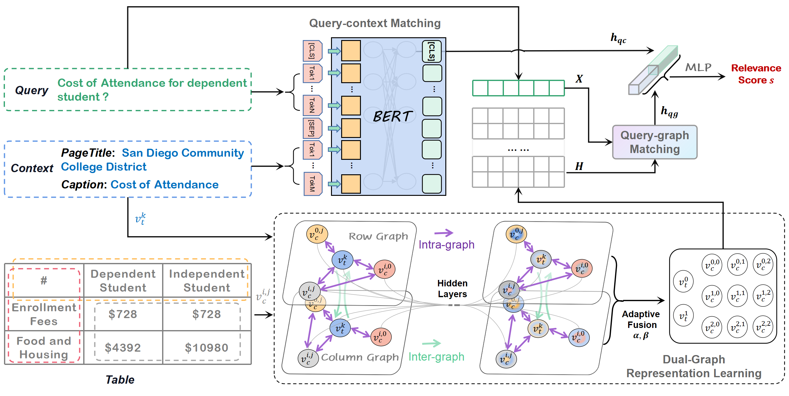

DualG
==========

This repo contains the example pytorch code for the paper [Enhancing Table Retrieval with Dual Graph Representations]. 

This paper/code aims to enhance table retrieval with Dual Graph Rrepresentations. We first decouple a table into the row view and column view, then build dual graphs with the consideration of table contexts. Afterward, intra-graph and inter-graph interactions are iteratively performed, and an adaptive fusion strategy is tailor-made for sophisticated table representations. In this way, the input query can match the target tables and achieve the ultimate ranking results more accurately.

See below for an overview of the model architecture:



## Requirements

- python3 (tested on 3.7.11)
- pytorch (tested on 1.11.0)
- networkx (tested on 2.5)
- dlg (tested on 0.8.0.post2)

Install requirements:

```bash
pip install -r requirements.txt
```

## Preparation

The code requires that you have access to the WikiTables dataset and Webquerytable dataset.


First, download and unzip [FastText vectors](https://fasttext.cc/docs/en/pretrained-vectors.html):

```bash
wget https://dl.fbaipublicfiles.com/fasttext/vectors-wiki/wiki.en.zip
unzip wiki.en.zip
```


Next, install [trec_eval tool](https://github.com/usnistgov/trec_eval):

```bash
git clone https://github.com/usnistgov/trec_eval.git
cd trec_eval
make
```


## Training

To run cross validation on WikiTables dataset:
```bash
python run.py --dataset wikitables
```

Training DualG on Webquerytable dataset:
```bash
python run.py --dataset webquerytable
```

Model checkpoints and logs will be saved to `saved/model_*.pt` and `saved/results_*/*.log`, respectively.


Detailed parameter information used in `configs/*.json`.


## Citation

```bibtex
@inproceedings{liu2023enhancing,
  title={Enhancing Table Retrieval with Dual Graph Representations},
  author={Liu, Tianyun and Zhang, Xinghua and Zhang, Zhenyu and Wang, Yubin and Li, Quangang and Zhang, Shuai and Liu, Tingwen},
  booktitle={Joint European Conference on Machine Learning and Knowledge Discovery in Databases},
  pages={107--123},
  year={2023}
}
```